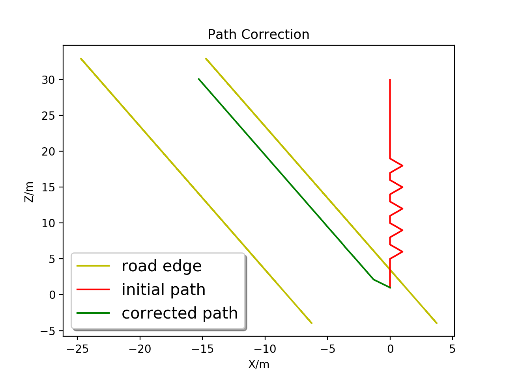
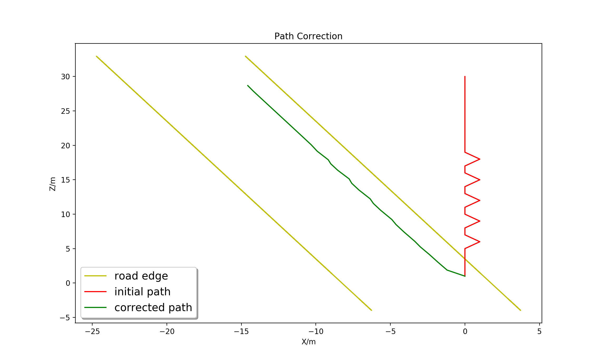
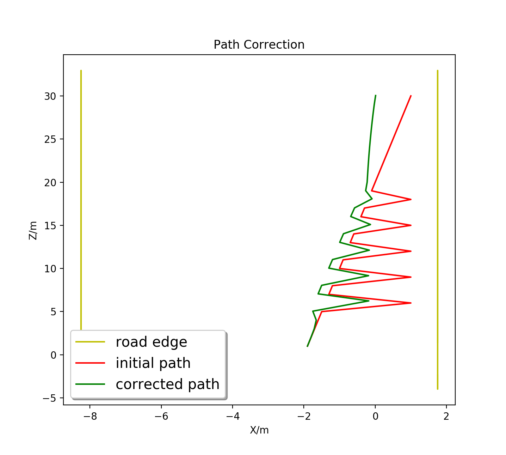
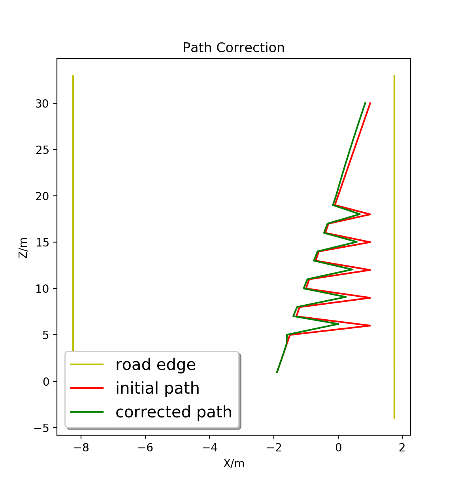

## Visual Odometry Drift Correction Based on Drivable Region

We use drivable region to correct the visual odometry drift for driveless vehicle. The assumations are that 1. the camera height is fixed and known; 2. the vehicle are not likely drive out of road region.


### requirement
1. Eigen 
	* install eigen https://gitlab.com/libeigen/eigen (for mac, try brew install eigen)
	* configure eigen include path and lib path in CMakeLists
2. g2o
	* build from source https://github.com/RainerKuemmerle/g2o
	* remember `make install` 
3. pybind11 
	* https://github.com/pybind/pybind11
	* just put it on project folder

# build 
```
mkdir build 
cd build 
cmake .. 
make 
```
then you got a python lib in `lib` older which you can import use use by python


### Demo
```
cp lib/vocorrection.cpython-xxx.so script/
python script/demo.py

```

### Code interface
```
import vocorrection as vs
# fx,fy are focus length, cx,cy are optical center
# wc,hc are vehilce width and camera height
vco = vc.EgoMotionCorrection(fx,fy,cx,cy,wc,hc)

# path correction
# path [n,3] position relative to initial camera frame
# lamda [n] information paramter, set larger if you trust a motion more
# fa,fb,fc right side road edge function f(u,v)=fa*v*v+fb*v+fc-u
# return corrected path [n,3]
path_c = vco.correct(path,lamdas,fa,fb,fc)
```

### some result
path correct result when lamda is 1


path correct result when lamda is 10


path correct result when lamda is 10


path correct result when lamda is 100
